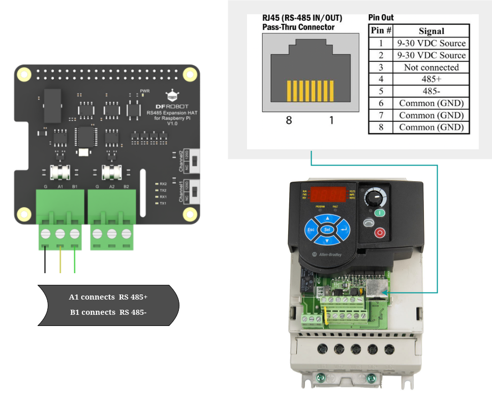

# VFD Control System
Variable Frequency Drive Controller with RS-485 Modbus RTU for High-RPM Motor Control

## Hardware Details
- **PowerFlex 4M** Adjustable Frequency AC Drive (22F-UM001C-EN-E unit)
- **DFROBOT RS485 HAT** for Raspberry Pi
- **Raspberry Pi 4B**

## Schematics

### RS485 Connection Diagram


**RJ45 (RS-485 IN/OUT) Pinout:**

| Pin # | Signal          |
|-------|-----------------|
| 1     | 9-30 VDC Source |
| 2     | 9-30 VDC Source |
| 3     | Not connected   |
| 4     | 485+            |
| 5     | 485-            |
| 6     | Common (GND)    |
| 7     | Common (GND)    |
| 8     | Common (GND)    |

### Raspberry Pi Connection


## Setup Steps

1. **Hardware Assembly**
   - Mount the DFROBOT RS485 HAT onto Raspberry Pi's GPIO header
   - Connect RJ45 cable between PowerFlex 4M and RS485 HAT:
     - Pin 4 (485+) to HAT's A1
     - Pin 5 (485-) to HAT's B1
     - Any GND pin (6-8) to HAT's GND

2. **Software Configuration**
   ```bash

    git clone https://github.com/WiringPi/WiringPi.git
    cd WiringPi
    ./build
   ```
    Enable the SPI interface and select the proper option from the menu
    
    ```bash
    sudo raspi-config
    ```
    
    Reboot the RaspberryPi board to make sure the spidev0.0 is available for rx/tx
    ```bash
    sudo reboot
    ```
    Compile and start the application, 
    
    ```bash
    gcc ch432_polling_based.c -lwiringPi -o vfd_app && ./vfd_app
    ```
