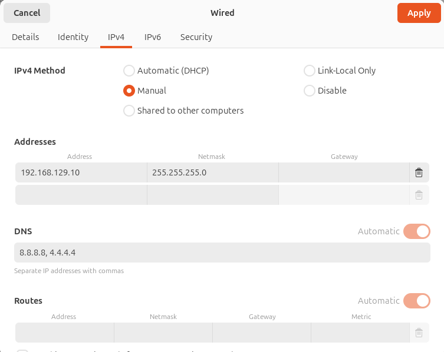

## Inside Ubuntu PC
  
```
  sudo ifconfig ethxx 192.168.129.10
```
Assuming wlp1s0 ip is 192.168.129.250,

```
  sudo sysctl -w net.ipv4.ip_forward=1
```
```
 sudo vi /etc/sysctl.conf
```
Uncomment net.ipv4.ip_forward=1,

```
  sudo iptables -t nat -A POSTROUTING -o wlp1s0 -j MASQUERADE
  sudo apt install iptables-persistent
  sudo sh -c "iptables-save > /etc/iptables/rules.v4"  
  sudo systemctl restart NetworkManager
  ip route show
```
Expected output --> <p textdefault via 192.168.129.111 dev wlp1s0 proto dhcp src 192.168.129.250 metric 600

## Inside Raspberry pi

```
ifconfig eth0 192.168.129.12
sudo ip route add default via 192.168.129.10 dev eth0
```

