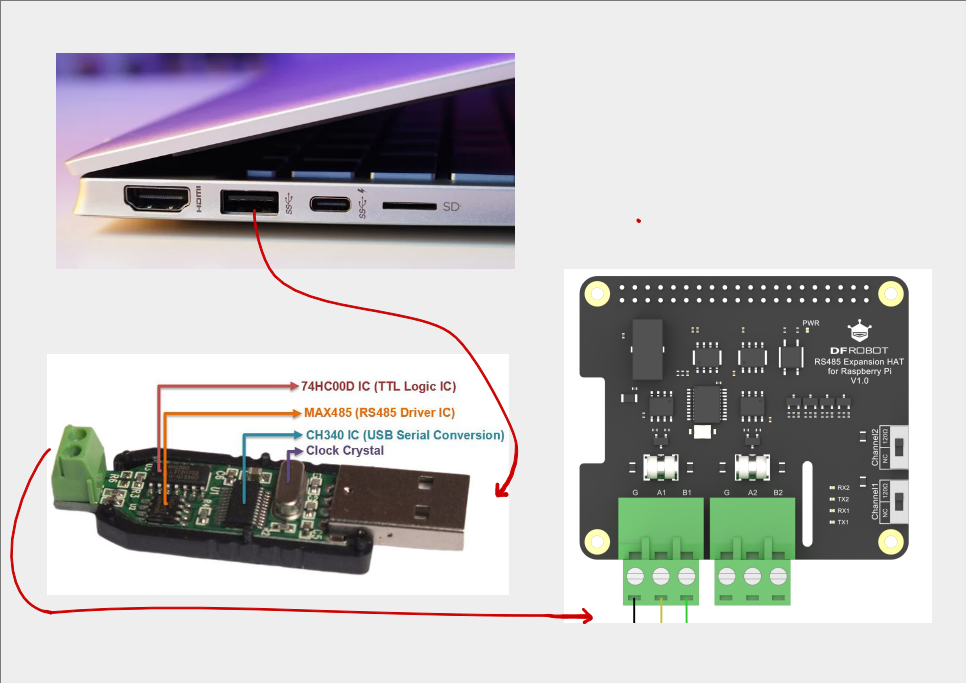

# Modbus RS485 Communication (Master-Slave) Example

  
*Figure 1: Master-Slave Communication Architecture*

This project demonstrates Modbus RTU communication over RS485 between:
- **Master**: Raspberry Pi (with RS485 HAT)
- **Slave**: PC with USB-to-RS485 adapter

## System Overview

The system consists of:
1. **Slave Application**: Written in C using `libmodbus`, running on PC
2. **Master Application**: `vfd_app` running on Raspberry Pi
3. **Physical Layer**: RS485 serial communication (differential signaling)

## Hardware Connection Diagram

### Wiring Specification
| Master (RPi) | Slave (PC) | Cable Color |
|--------------|------------|-------------|
| RS485+ (A+)  | A+         | Brown       |
| RS485- (B-)  | B-         | Blue        |
| GND          | GND        | Green/Yellow|

> **Note**: Termination resistor (120Ω) required if cable length > 10m

## Software Implementation

### Slave Setup (PC)
```bash
# Install dependencies
sudo apt-get update
sudo apt-get install libmodbus-dev build-essential

# Compile and run slave application
gcc modbus_slave_usb_rs485.c -lmodbus -o vfd_slave -Wall
./vfd_slave
